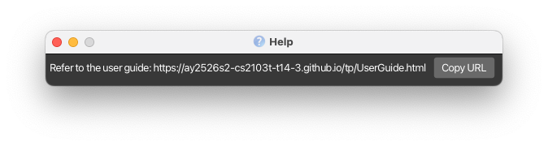

HRdex is a desktop application designed for **NUS CCA leaders** who need a simple and efficient way to manage CCA's interview records. Other university CCA leaders are welcome to use it too.

The application is optimized for users who prefer a **Command Line Interface (CLI)** while still benefiting from a graphical interface. HRdex allows CCA leaders to quickly add, search, view, and delete a person's information without navigating complicated menus.

* Table of Contents
{:toc}

--------------------------------------------------------------------------------------------------------------------

## Quick start

1. Ensure you have Java `17` or above installed on your Computer. 
   **Mac users:** Ensure you have the precise JDK version prescribed [here](https://se-education.org/guides/tutorials/javaInstallationMac.html).

1. Download the latest `.jar` file from [here](https://github.com/AY2526S2-CS2103T-T14-3/tp/releases).

1. Copy the file to the folder you want to use as the _home folder_ for HRdex.

1. Open a command terminal, `cd` into the folder you put the jar file in, and use the `java -jar [CS2103T-T14-3][HRdex].jar` command to run the application. 
   A GUI similar to the below should appear in a few seconds. Note how the app contains some sample data. 
   

1. Type the command in the command box and press Enter to execute it. e.g. typing **`help`** and pressing Enter will open the help window. 
   Some example commands you can try:

   * `list` : Lists all persons.

   * `add n/John Doe p/98765432 e/johnd@example.com a/John street, block 123, #01-01` : Adds a person named `John Doe` to HRdex.

   * `delete 3` : Deletes the 3rd person shown in the current list.

   * `clear` : Deletes all persons records.

   * `exit` : Exits the app.

1. Refer to the [Features](#features) below for details of each command.

--------------------------------------------------------------------------------------------------------------------

## Features

**:information_source: Notes about the command format:** 

* Words in `UPPER_CASE` are the parameters to be supplied by the user. 
  e.g. in `add n/NAME`, `NAME` is a parameter which can be used as `add n/John Doe`.

* Items in square brackets are optional. 
  e.g `n/NAME [t/TAG]` can be used as `n/John Doe t/friend` or as `n/John Doe`.

* Items with `…`​ after them can be used multiple times including zero times. 
  e.g. `[t/TAG]…​` can be used as ` ` (i.e. 0 times), `t/friend`, `t/friend t/family` etc.

* Parameters can be in any order. 
  e.g. if the command specifies `n/NAME p/PHONE_NUMBER`, `p/PHONE_NUMBER n/NAME` is also acceptable.

* Extraneous parameters for commands that do not take in parameters (such as `help`, `list`, `exit` and `clear`) will be ignored. 
  e.g. if the command specifies `help 123`, it will be interpreted as `help`.

* If you are using a PDF version of this document, be careful when copying and pasting commands that span multiple lines as space characters surrounding line-breaks may be omitted when copied over to the application.

### Viewing help : `help`

Shows a message with basic commands format with summary and link to access the help page.

Format: `help`

### Adding a person record: `add`

Adds a person record to HRdex.

Format: `add n/NAME p/PHONE_NUMBER e/EMAIL a/ADDRESS [t/TAG]…​`

* `NAME` must only contain letters, spaces, hyphens, and apostrophes, and must not be blank. Surrounding spaces are trimmed.
* `PHONE_NUMBER` is the unique identifier — no two persons can share the same number.
* A person can have any number of tags (including 0).

Examples:
* `add n/John Doe p/98765432 e/johnd@example.com a/John street, block 123, #01-01`
* `add n/Betsy Crowe t/friend e/betsycrowe@example.com a/Blk 30 Clementi Ave 3 p/1234567 t/year2`

Command fail:

Error | Reason
------|-------
`This person already exists in the HRdex` | `PHONE_NUMBER` is already in use — use a unique number
`Names should only contain letters...` | `NAME` contains unsupported characters — use only letters, spaces, hyphens, or apostrophes
`Phone numbers should only contain numbers...` | `PHONE_NUMBER` must be digits only, at least 3 digits long
`Emails should be of the format local-part@domain...` | `EMAIL` does not meet format requirements. You may try checking that your email follows `user@example.com` with a valid domain
`Multiple values specified for [x/]` | A single-value field was given more than once. You may try removing duplicate prefixes (only `t/` accepts multiple values)
`Invalid command format!` | Parameters are missing or in the wrong order

### Deleting a person record: `delete`

Deletes a person record in HRdex.

Format: `delete INDEX`

* The `INDEX` **must be a positive integer** 1, 2, 3, …​
* Deleting a person with an interview record also deletes the interview record.

Examples:
* `list` followed by `delete 2` deletes the 2nd person in HRdex.
* `find Betsy` followed by `delete 1` deletes the 1st person in the results of the `find` command.

*Expected output:*

Command fail:

Error | Reason
------|-------
`The person index provided is invalid` | `INDEX` is out of range
`Invalid command format!` | `INDEX` missing or not a positive integer

### Listing all persons : `list`

Shows a list of all persons in the HRdex.

Format: `list`

### Editing a person : `edit`

Edits an existing person in the HRdex.

Format: `edit INDEX [n/NAME] [p/PHONE_NUMBER] [e/EMAIL] [a/ADDRESS] [t/TAG]…​`

* `INDEX` **must be a positive integer** 1, 2, 3, …​
* At least one optional field must be provided.
* When editing tags, all existing tags are replaced. Use `t/` with no value to clear all tags.

Examples:
*  `edit 1 p/91234567 e/johndoe@example.com` Edits the phone number and email address of the 1st person.
*  `edit 2 n/Betsy Crower t/` Edits the name of the 2nd person and clears all existing tags.

*Expected output:*

Command fail:

Error | Reason
------|-------
`The person index provided is invalid` | `INDEX` is out of range
`At least one field to edit must be provided.` | No fields were given — provide at least one of `n/`, `p/`, `e/`, `a/`, or `t/`
`Names should only contain letters...` | `NAME` contains unsupported characters — use only letters, spaces, hyphens, or apostrophes
`Phone numbers should only contain numbers...` | `PHONE_NUMBER` must be digits only, at least 3 digits long
`Emails should be of the format local-part@domain...` | `EMAIL` does not meet format requirements. You may try checking that your email follows `user@example.com` with a valid domain
`Multiple values specified for [x/]` | A single-value field was given more than once. You may try removing duplicate prefixes (only `t/` accepts multiple values)
`Invalid command format!` | Parameters are missing or in the wrong order

### Locating persons: `find`

Finds persons whose details contain any of the given keywords.

Format: `find KEYWORD [MORE_KEYWORDS]`

* The search is case-insensitive. e.g `hans` will match `Hans`
* The order of the keywords does not matter. e.g. `Hans Bo` will match `Bo Hans`
* Names, phone numbers, emails, addresses and tags are searched.
* Partial words will be matched e.g. `Han` will match `Hans`
* Persons matching at least one keyword will be returned (i.e. `OR` search).
  e.g. `Hans Bo` will return persons with the name `Hans Gruber`, `Bo Yang`

Examples:
* `find John` returns `john` and `John Doe`
* `find 9123` returns persons whose phone number contains `9123`
* `find A1234567B` returns `James` tagged with `A1234567B` 
  
* `find alex david` returns `Alex Yeoh`, `David Li` 
  

Command fail:

Error | Reason
------|-------
`Invalid command format!` | No keyword provided after `find`

### Editing an interview record : `edit-i`

Edits an interview record of a person on HRdex.

Format: `edit-i INDEX`

* `INDEX` **must be a positive integer** 1, 2, 3, …​
* Opens a popup editor for the person. Changes are only saved when Enter is pressed — closing the popup discards unsaved changes.

Examples:
* `list` followed by `edit-i 2` edits the interview record of the 2nd person in HRdex.
* `find Betsy` followed by `edit-i 1` edits the interview record of the 1st person in the results of the `find` command.

*Expected output:*

*Popup editor:*

Command fail:

Error | Reason
------|-------
`The person index provided is invalid` | `INDEX` is out of range
`The person's index must be provided` | No `INDEX` was given
`Invalid command format!` | Parameters missing or in wrong order

### Deleting an interview record : `delete-i`

Deletes an interview record of a person on HRdex.

Format: `delete-i INDEX`

* `INDEX` **must be a positive integer** 1, 2, 3, …​

Examples:
* `list` followed by `delete-i 2` deletes the interview record of the 2nd person in HRdex.
* `find Betsy` followed by `delete-i 1` deletes the interview record of the 1st person in the results of the `find` command.

*Expected output:*

Command fail:

Error | Reason
------|-------
`The person index provided is invalid` | `INDEX` is out of range
`This person has no interview record.` | No interview record is linked to this person
`Invalid command format!` | Parameters missing or in wrong order

### List all interview records : `list-i`

Shows a list of all interview records in HRdex.

Format: `list-i`

* The interview record list displays records in the order they were created.
* Any parameters after `list-i` are ignored.

### Finding interview records by keyword : `find-i`

Finds persons whose interview records contain specific keywords.

Format: `find-i KEYWORD [MORE_KEYWORDS]`

* The search is case-insensitive. e.g. `java` will match `Java`
* The search checks the content of interview records entered in the popup window.
* Persons whose interview records contain any of the given keywords will be displayed.
* Partial words will be matched e.g. `goo` will match `good`

Examples:
* `find-i java`
* `find-i communication teamwork`

Command fail:

Error | Reason
------|-------
`Invalid command format!` | No keyword provided after `find-i`

### Clearing all entries : `clear`

Clears all entries in HRdex.

Format: `clear`

### Exiting the program : `exit`

Exits the program.

Format: `exit`

### Saving the data

HRdex data are saved in the hard disk automatically after any command that changes the data. There is no need to save manually.

### Editing the data file

HRdex data are saved automatically as a JSON file `[JAR file location]/data/addressbook.json`. Advanced users are welcome to update data directly by editing that data file.

:exclamation: **Caution:**
If your changes to the data file makes its format invalid, HRdex will discard all data and start with an empty data file at the next run. Hence, it is recommended to take a backup of the file before editing it. 
Furthermore, certain edits can cause HRdex to behave in unexpected ways (e.g., if a value entered is outside of the acceptable range). Therefore, edit the data file only if you are confident that you can update it correctly.

### Archiving data files `[coming in v2.0]`

_Details coming soon ..._

--------------------------------------------------------------------------------------------------------------------

## FAQ

**Q**: How do I transfer my data to another computer? 
**A**: Install the app in the other computer and paste the `/data` folder you copy from your previous home folder (the original computer) into the new home folder (the other computer).

--------------------------------------------------------------------------------------------------------------------

## Known issues

1. **When using multiple screens**, if you move the application to a secondary screen, and later switch to using only the primary screen, the GUI will open off-screen. The remedy is to delete the `preferences.json` file created by the application before running the application again.
2. **If you minimize the Help Window** and then run the `help` command (or use the `Help` menu, or the keyboard shortcut `F1`) again, the original Help Window will remain minimized, and no new Help Window will appear. The remedy is to manually restore the minimized Help Window.

--------------------------------------------------------------------------------------------------------------------

## Command summary

Action | Format, Examples
--------|------------------
**Help** | `help`
**Add** | `add n/NAME p/PHONE_NUMBER e/EMAIL a/ADDRESS [t/TAG]…​`   e.g., `add n/James Ho p/22224444 e/jamesho@example.com a/123, Clementi Rd, 1234665 t/friend t/colleague`
**Delete** | `delete INDEX`  e.g., `delete 3`
**List** | `list`
**Edit** | `edit INDEX [n/NAME] [p/PHONE_NUMBER] [e/EMAIL] [a/ADDRESS] [t/TAG]…​`  e.g.,`edit 2 n/James Lee e/jameslee@example.com`
**Find** | `find KEYWORD [MORE_KEYWORDS]`  e.g., `find James Jake` or `find A1234567B`
**Edit Interview Record** | `edit-i INDEX`  e.g., `edit-i 1`
**Delete Interview Record** | `delete-i INDEX`  e.g., `delete-i 1`
**Interview List** | `list-i`
**Find Interview Record** | `find-i KEYWORD [MORE_KEYWORDS]`  e.g., `find-i Good`
**Clear** | `clear`
**Exit** | `exit`
